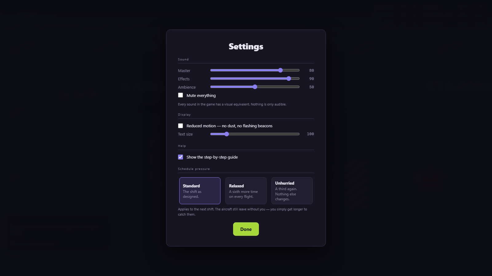

# Changelog

## Milestone 5 — onboarding and juice — 2026-08-20

**179 assertions, 779 total.** Exit criterion: *uncoached playtesters complete the core
loop.* The three things standing between a stranger and that loop were silence, no
teaching, and no way to turn the pressure down. All three are now fixed.

**Audio — `systems/audio.js`.** The game had no sound at all; every GDD §18 cue was
visual-only. Now: bags thump off the belt and onto the floor, the scanner beeps and
chirps or buzzes depending on the verdict, hitching clunks, the tractor engine pitches
with its own speed, flight transitions chime and escalate, and hold closing lands as a
low sawtooth. Three continuous beds — belt, ramp, engine — sit under it.

**Structure copied from `SmallTownEmergencyServices\src\audio\audio.js`** per
`Dev\INDEX.md`, keeping the names `mixFor`, `CUES`, `atten`, `tone` and `toneP`. (That
file took `tone`/`toneP` from `Chameleon\chameleon3d.html:2190`. The synth has now been
written four times across this tree; this is the fourth adaptation, not a fifth
invention — the first draft here *was* a fifth invention, and was replaced.)

Four rules hold it in place, and the suite enforces each:

- **Inert until armed.** No `AudioContext` exists until a real user gesture, and every
  subscription drops the event outright while unarmed — so the title screen costs nothing.
- **Audio reads the simulation and never writes to it.** m5 section E runs the same
  200-second shift twice, once with a live `Sfx` attached and once with none, and demands
  the `describe()` snapshots match to the byte. They do. Arming, updating, muting and
  tearing the graph down all leave the simulation identical.
- **The decision is separate from the plumbing.** `mixFor(state)` is a pure function from
  world state to target loudnesses, and one-shots are a data table keyed by event name.
  That seam is what lets section H assert the *interesting* half on a headless box with no
  sound card: that the engine bed gets louder and higher as you accelerate, that a paused
  airport is silent, that final call is more insistent than loading, and that every cue
  row names an event the game really emits. Section E proves audio has no authority;
  section H proves it is correct.
- **Every cue has a visual equivalent.** Nothing in the game is audible-only, which is
  what makes the mute switch a preference rather than a handicap.

**The first minute — `systems/onboarding.js`.** A seven-step rail: move, grab, scan,
cart, drive, hitch, load. **There are no training pauses**, because there cannot be — the
airport never waits (GDD pillar 1), and a tutorial that stops the clock would teach a lie
about the only thing the game is about. So the rail is advisory text over a completely
live shift, and the flights are already running while you learn to pick a bag up.

Every step asserts **the state it wanted, never the route you took**, so a player who
does things out of order collapses the chain forward instead of deadlocking on a step
they already satisfied. GDD §16.5 asks for hints on a stall rather than up front: after
eleven seconds on one step, a second line appears with the specific thing you are missing.

**Accessibility and settings — `ui/settings.js`.** GDD §16.6 asks for eight things. Four
were already true by construction — keyboard-only operation, colourblind-safe tag codes
and icons, visual equivalents for every sound, and key bindings that are already data.
The panel adds the other four: per-category volumes with a mute, reduced motion, text
scaling, and a **difficulty assist that alters schedule pressure without touching a
single verb**.

The assist is a multiplier applied once, where the flight times are authored — so the
board, the countdowns and the derived shift end all follow automatically. Standard is the
authored 8:07; Unhurried stretches it to 12:49. Nothing else changes: same fifty bags,
same order, same weights, same reach. `CONFIG` stays deep-frozen.

Reduced motion kills the particle system outright and holds the tractor beacon and the
aircraft strobe steady, rather than dimming them — a faint strobe is still a strobe. Text
scaling runs through a single `--ts` CSS multiplier that every font size in the stylesheet
now reads.

Settings persist through `SaveSystem`, and are reachable from both the title card and the
pause screen.

## Visual overhaul — 2026-08-19

Playtest note: *"I like the angle better, but it's still just basic geometric shapes with
no animation."* Both true. The oblique pass fixed the camera and left everything on it a
rounded rectangle.

**Animation, derived rather than stored.** Every moving part reads a value the simulation
already owns — the walk cycle from `player.walkedM`, wheels from `odometerM` and a new
`cart.rolledM`, beacons and strobes from `simTimeMs`. That buys three things at once: the
renderer stays stateless, two runs of a seed animate identically, and a paused game
freezes mid-stride instead of jogging on behind the pause card.

- **The crew walk.** Legs swing about the hip on a 1.75 m stride, the body bobs on each
  footfall, arms counter-swing, and there is a slow breath when standing still. Carrying
  puts both arms out front; a throw wind-up drags the near arm back and leans the torso.
  Facing changes the head, the eyes and which way the hard-hat brim points.
- **Wheels turn.** Tractor and cart wheels rotate on distance actually travelled, with a
  spoke so the rotation is visible.
- **The cargo door travels.** `holdOpen` is the rule and flips on the tick; `door01` eases
  over about a second, so hold closing is something you watch come down rather than a
  state that silently flipped (GDD §5.3).
- **An amber beacon** on the tractor and an **anti-collision strobe** on the aircraft,
  both on simulation time so both stop when the game does.

**Surfaces, not fills.** `render/textures.js` builds tarmac, sealed concrete and worn
road as procedural tiles — aggregate speckle, patches, hairline cracks, slab joints, cart
scuffs, worn wheel paths. `canvasTex` is copied from Something's Different (Dev\INDEX.md
→ "Procedural geometry & texture"), keeping the name; adapted to return a CanvasPattern
and to draw from a **seeded** stream, so a texture is byte-identical every run.

**Props that are objects.** Bags now have a physical kind — suitcase with a pull handle
and wheels, duffel with end panels and a strap, hardcase with ribs and metal corner caps,
backpack with a front pocket and shoulder straps. Carts have plank decks and side rails;
the tractor has a body stripe, a seat, a steering column and a roll cage; the aircraft has
engines slung under the wings and landing gear.

**`render/fx.js`** — dust when a bag lands, dust and grit when a cart sheds one on a
corner, a small green tick when one goes into the hold. Shape copied from
`Brainrot\animations.js` `class FX`, keeping the name; three changes: seeded rather than
`Math.random` (m0 G1 forbids it and a screenshot has to be reproducible), world-space in
metres so particles sit correctly under an oblique camera, and no screen shake — GDD
§16.6 requires that to be adjustable and there is no settings screen until M5. It reacts
to bus EVENTS rather than diffing frames, and it is capped (GDD §24.1).

Tuned along the way: the asphalt speckle was skewed light and read as noise; the cargo
door was first drawn mid-fuselage, where it looked like a hatch in the roof.

600 assertions still green — none of this touches the simulation.

## Milestone 4 — outcomes and pressure — 2026-08-19

**Exit criterion: full acceptance tests for all outcome paths pass. Met.**
113 new assertions, 600 total (`tools\test.ps1`).

Built:

- **`systems/scoring.js`** on GDD §11.1's values verbatim: +100 a correct bag, +50 more
  if it was priority, −250 for the wrong aircraft, −150 for a miss, plus a completion
  bonus for a flight that got everything. The ordering §11.1 asks for is preserved — a
  wrong destination costs more than a simple miss.
- Points are awarded **once, at departure**, by a PULL pass over flights that have
  evaluated but not been scored. Idempotent and order-independent, so it cannot
  double-count. Deliberately no running per-load score: a bag can be taken back out of a
  hold before closure, and a number that lies for twenty seconds is worse than none.
- **The shift ends** a wrap-up after the last aircraft is clear, derived rather than
  authored — the hardcoded ten minutes was leaving two minutes of empty ramp. It lands
  at 8:07, inside the 8–12 minutes GDD §3.3 asks for. Once ended, nothing moves.
- **`ui/shiftReport.js`**: GDD §11.2 service metrics, a per-flight breakdown, two to four
  odd statistics per §11.3, and a replay button. The verdict line is never cruel about a
  bad shift — GDD §10.4 wants a messy shift to still feel survivable.
- **`systems/save.js`** keeps the best shift per GDD §23.1. Shape copied from
  TheBenefactors' `SaveSystem`; its slots, migrations and whole-state snapshots dropped,
  because this stores one small record. Storage that refuses is survived silently.

Measured: a worked shift scores 6100 with 50/50 on time and 3 perfect flights; an
untouched one scores −7500 with 0/50.

Fixed: `evaluateFlight` walked `expectedBagIds`, so a bag that reached a flight by any
route other than the conveyor finished the shift still marked `active` — classified by
nothing. It walks ownership now.

---

## Oblique 2.5D — 2026-08-19

Playtest note: *"not sure how I feel about the completely top down, dot on the map kinda
look."* Fair — it read as a floorplan. GDD §19.1 permits "top-down **or 2.5D**", so this
is inside the brief rather than the §31.5 presentation change that needs sign-off.

The renderer now runs two passes: **the ground**, foreshortened vertically by 0.75 so
floors and markings recede; and **things that stand up**, drawn upright at their
foreshortened base with height going up the screen and depth-sorted by base y. Text and
circles are never drawn on the ground transform — they would be squashed with it.
Rotatable boxes are extruded in slices, translating *before* rotating so the extrusion
stays screen-vertical rather than tilting with the object.

The player is a person with a hard hat and hi-vis rather than a disc with a dot. Bags are
boxes with visible sides, carts have a bed with thickness, the aircraft stands over its
own wings.

Two numbers moved with it, both for reasons worth keeping:

- **viewWidthM 62 → 46.** Foreshortening fits *more* world into the same pixels
  vertically, so keeping the old width made everything read smaller — the opposite of the
  point. A bag is now 25 px and a person 60 px tall.
- **The drawn fuselage is 1.9 m, not its real 3.2 m.** At true height it was a
  featureless white wall that buried its own wings and most of the stand.

### And a harness bug that produced confidently wrong evidence

`shot.ps1` and `smoketest.ps1` checked only "did something answer 200 on this port".
Other projects on this machine run the same tooling with the same scratch filenames —
SmallTownEmergencyServices and TowBros were both copied from here — so the probe attached
to **another game's server** and wrote a screenshot of Small Town Emergency Services into
`docs/` as if it were this game. It fails silently.

`tools/_serve-mine.ps1` now stamps the scratch file with a GUID and refuses any port
whose response does not contain that exact stamp, walking a range until it finds one
serving *this* project. A test run hijacked the same way would have reported another
game's results as ours.

## Milestone 3 — the sacred schedule — 2026-08-19

**Exit criterion: a no-input shift completes deterministically. Met.**
105 new assertions, 487 total (`tools\test.ps1`).

Built:

- **`stateAt(times, simTimeMs)` — the whole antagonist, as a pure function.** It takes
  the authored times and the clock, and nothing else. There is no argument that could
  carry player readiness and no closure it could read one from, so GDD §31.1.7 ("never
  make a flight wait for task completion") is enforced by shape rather than by
  discipline. The suite proves it: the same flight at the same instant returns the same
  state for an idle crew, a swamped one, and one that has already loaded everything.
- **The full GDD §5.1 lifecycle** — SCHEDULED, BAG_ACCEPTANCE, LOADING, FINAL_BAG_CALL,
  HOLD_CLOSING, PUSHBACK, DEPARTED — each transition landing on its exact millisecond
  and never running backwards.
- **Aircraft on stand.** One regional type per GDD §9.1: taxis in to finish exactly at
  bag acceptance, sits on its marks, pushes back exactly at departure. The hold is a
  real oriented box, not a proximity radius, because §9.1 is explicit that a bag counts
  as loaded only when released *inside the valid hold volume* — touching the fuselage
  does not count, and the suite asserts that specifically.
- **Loading and unloading.** Carry or throw a bag through an open door and it is aboard.
  Take it back out before closure and it stops counting. Load somebody else's bag and
  the game lets you — the scanner says "wrong", it does not refuse (GDD §31.1.8).
- **Hold closing means closed.** After HOLD_CLOSING nothing more goes in, from any
  route: not by hand, not thrown, not from a cart. A bag lying in the doorway of a
  sealed aircraft stays on the ramp.
- **Departure evaluates every expected bag** (GDD §5.2). Correct, misrouted, missed —
  counted once, with the arithmetic closing: owed equals delivered plus missed. Wrongly
  loaded bags travel anyway and record where they actually went. Missed bags stay
  exactly where they are, physical and retrievable, because §5.2 requires it.
- **Three readability channels** (GDD §5.3): the flight board with status, countdown and
  a loaded-of-expected count; announcement toasts; and the aircraft itself, whose door
  reads HOLD OPEN or HOLD CLOSED. Colour is reinforcement on all three — turn every hue
  off and the board still spells out what is happening.
- **Debug**: `,` skips to just before the next flight event, and `forceDeparture()` pushes
  a flight to pushback now (GDD §21.8).

Measured, printed by the suite on every run:

| | |
|---|---|
| A no-input shift | all 3 flights depart, all 50 bags classified, 0 delivered |
| The same shift, worked by a scripted bot | 50 of 50 delivered, 100% on-time baggage |
| Cost of a step of the whole airport | 0.07 ms against a 16.67 ms budget |
| Ten minutes of airport | simulates in ~2.5 s, about 240x real time |
| Gate 1, used twice | AB221 clear at 195 s, SK307 taxis in at 201 s |

Fixed during the milestone:

- **SK307 was double-booking gate 1.** Its acceptance was 200 s, but AB221's aircraft is
  not clear of the stand until 195 s once the taxi-in and pushback are counted — and
  SK307's own taxi-in would have started at 196 s. `gateConflicts()` compared
  acceptance-to-departure, which is narrower than the window a stand is actually
  occupied; it now compares the real window, and SK307 moved to 205 s.
- **The wings read as grey slabs** laid across the stand. Swept and tapered, and the
  wingspan cut from 24 m to 21 m so it fits a 22 m stand instead of overhanging it.
- **HOLD OPEN was printed underneath the crew**, where the player, the cart and the hold
  zone all crowd the same few metres. Moved beside the door.

Two tests changed because their premise expired rather than because anything broke:

- m1 C10 asserted every bag is still `active` after a full shift. Since departures now
  classify what they were owed, that stopped being true the moment flights began
  leaving; the invariant was always about how a bag STARTS, so it samples early now.
- m3 F13 first asserted a whole shift simulates in under 3 s and passed by five
  milliseconds. A threshold that tight is a flake, not a check — it measures per-step
  cost against the frame budget now, which is the number that actually means something.

Not built, on purpose: scoring, the shift report, audio, save. A perfectly worked shift
and a disastrous one still produce the same nothing at the end — that is Milestone 4.

## Milestone 2 — transport — 2026-08-19

**Exit criterion: a full cart can travel to either gate without state corruption. Met.**
140 new assertions, 382 total (`tools\test.ps1`).

Built:

- **Carts.** Ten fixed slots, capacity by space AND weight (both bind: ten light bags run
  out of slots at 90 kg, heavy ones run out of weight at six), a placard the player sets
  or ignores, and a stability score. Bags in a cart are pinned to slots rather than
  simulated — GDD §21.6 — which is what makes "arrives without corruption" a property
  instead of a hope.
- **`systems/hitching.js`.** Trains are a linked chain with a back-pointer, and
  `validateChain()` proves the two halves of every link still agree — the GDD §28.1 unit
  test, run after every hitch, every unhitch, every step of every drive, and live in the
  debug overlay. It catches one-sided links, a cart towed by two parents, and cycles.
- **The tractor.** Throttle, brake, reverse that brakes first, and a yaw rate that ramps
  with speed. The turning RADIUS is a constant 1.7 m below the reference speed and grows
  to 3.9 m at full tilt — GDD §8.2 ("forgiving turning at low speed", wider arcs when
  fast) expressed as one formula rather than a table.
- **Towing by constraint.** Each cart is placed at a fixed distance behind its parent
  hitch, facing it. A long train cuts corners and swings wide for free, with no solver,
  and the drawbar cannot stretch: measured worst-case error over a full run to a gate was
  under 0.02 m.
- **Spillage.** Lateral load is speed × yaw rate scaled by how full the bed is; sustained
  load drains stability and an empty tank throws the top bag off the outside of the turn.
  A spilled bag lands on the ramp, physical and retrievable, and a cooldown stops the
  cart that just lost it from swallowing it again on the next frame.
- **The loading verbs.** E at a cart loads the held bag, or takes one back off the top.
  A thrown bag that lands in a cart is caught by it. F sets the placard on foot, climbs
  in and out of the tractor, and E hitches or unhitches while driving.
- **Layout change.** The two marked bays moved from the far side of the sort room up to
  the belt. At Milestone 1 the carry was ~17 m per bag; with carts as the target that
  walk is the whole loop and it was far too long. It is now ~7 m — the pressure should
  come from choosing the right cart and from the drive, not from walking.

Measured, printed by the suite on every run:

| | |
|---|---|
| Turning radius | 1.7 m at 1.5 m/s · 1.7 m at 3 m/s · 3.9 m at 7 m/s |
| Nought to top speed | 1.17 s |
| A loaded cart to gate 1 / gate 2 | 19.6 s / 20.6 s of driving, 10 of 10 bags delivered |
| Drawbar stretch over a full run | under 0.02 m |
| Cart capacity | 10 light bags (slots) · 6 heavy bags, 186 kg (weight) |
| Three-cart train, driven hard | 11 of 12 aboard, 1 shaken off |
| Ten bags, full-lock circle at 7 m/s | 9 shaken off |
| The same circle at 1.2 m/s | 0 spilled |
| Three loaded carts + 100 loose bags | 0.33 ms per step, against a 16.67 ms budget |

Fixed during the milestone:

- **You could load a bag into a cart and then be unable to get it back out.** A cart is
  2.4 m long and reach is 1.7 m, so the first slot sits at the far corner, out of range
  from the side you loaded it from. E with empty hands now takes the top of the pile when
  nothing specific is in reach — which is how you unload a cart in life too.
- **Spill was emptying a full cart in about a second** of hard cornering. Softened; one
  bad corner now costs a bag or two rather than the load. Milestone 6 owns the real
  balance pass, and these numbers are provisional.
- **Bags overhung the ends of the cart bed** by about 11 cm. Slot run inset.
- **The title card still said Milestone 0** and described a game with no bags in it.

Kept clean on purpose:

- The renderer needs to draw a placard, so `setPlacard()` writes a **denormalised display
  copy** (`placardLabel`, `placardColor`) beside the id. One writer, so it cannot drift,
  and the renderer still imports no flight data at all.
- The m0 source-hygiene check was rewritten to test for scoring and schedule LOGIC rather
  than for the words "score" and "flight". Drawing a flight code on a stand is legitimate
  and Milestone 3 will have to; computing a departure in the renderer never is.

Not built, on purpose: aircraft, flight state machine, holds, scoring, audio, save.

## Milestone 1 — the bag feels good — 2026-08-18

**Exit criterion: moving and sorting ten bags is reliable and pleasant. Met.**
125 new assertions, 242 total (`tools\test.ps1`).

Built:

- **Bags with identity.** Unique id, printed six-digit tag, flight, destination, gate,
  priority, weight class, scan history, condition, and a single authoritative
  `location`. Identity survives every move; the suite proves no bag is ever duplicated
  or lost across a full shift.
- **`systems/containment.js` — the one writer of `bag.location`.** Reverse indexes
  (`conveyor.bagIds`, `player.carryingBagId`) are derived and proven to agree by
  `assertContainment()`, which the debug overlay runs live and the suite runs after
  every interesting operation. Grabbing a second bag puts the first down rather than
  orphaning it. An unknown location type throws rather than being written.
- **The conveyor.** 21 m of belt at 1.6 m/s — a 13 s ride — running whether or not
  anyone is watching. Bags queue behind each other rather than overlapping, drop off the
  end onto the floor with a seeded sideways kick, and pile up. There is deliberately no
  overflow bin: the pile is the pressure.
- **The verbs.** Move, aim, grab, carry, put down, charge-and-throw, scan. Aim follows
  the mouse, or the direction of travel for keyboard-only play. Carrying a heavy bag
  slows the player and shortens the throw.
- **Arcade physics.** Axis-separated wall resolution so entities slide instead of
  sticking, linear friction with a dead-stop threshold, and positional push-apart
  between bags. The player shoves bags aside rather than being blocked by them — being
  unable to walk through your own mess would be realistic and miserable.
- **A uniform spatial grid** (GDD §24.2), rebuilt each step, so interaction and
  separation stay linear in bag count.
- **The scanner card.** Reports; never vetoes. It already says "wrong staging pad"
  because the two floor pads are gated by gate id, and it lets the mistake stand.
- **The authored shift** as static data: three flights, 50 bags, deterministic
  timetable with pressure peaks, late bags and the GDD §20.4 twists — MC184 heavy,
  SK307 priority-late. The flight state machine is still Milestone 3.
- **A following camera** at a zoom set by tag readability, plus a held-object indicator
  and a contextual prompt.

Measured, not assumed — printed by the suite on every run:

| | |
|---|---|
| Throw, normal bag | 1.4 m tapped · 12.1 m fully charged |
| Throw at full charge | 3.8 m heavy · 16.8 m light |
| Two seconds of walking | 8.1 m empty-handed · 5.1 m with a heavy bag |
| A bag thrown at 8 m/s | slides 1.35 s |
| Heavy bags per flight | AB221 6% · MC184 31% · SK307 39% |
| 100 loose bags | 0.28 ms per step, against a 16.67 ms budget |
| Unattended 10-minute shift | all 50 bags spawn, all 50 end on the floor, nothing lost |

Fixed during the milestone:

- **A fast feed stacked bags on top of each other at the belt entry.** Spawning now
  defers until the entry is clear, so the check-in feed backs up instead — which is what
  a real backlog does. The belt never stops, so a deferred bag always arrives, just late.
- **`buildBagSchedule` picked priority bags by rejection-sampling into a `Set`.** With
  SK307 needing 4 of a 6-wide late window it was already slow, and one edit to the twist
  numbers away from never terminating. Replaced with a seeded shuffle of a candidate
  pool.
- **The camera zoom broke world signage.** Every metre-space font was sized for
  Milestone 0 fit camera at ~10 px/m; at the follow camera ~26 px/m the zone labels
  swamped the sort room and the painted gate numbers were 13 m tall. Retuned, and the
  player is now drawn larger than its collider so it reads as a person rather than a dot.

Learned about the harness:

- **A suite of synchronous sections never yields to the event loop.** `await` on a
  synchronous function only queues a microtask, and animation frames are not microtasks,
  so the boot loop had never run, the canvas had never been sized, and the m1 render
  assertions were testing a 1x1 canvas. m0 only escaped this because its `await fetch`
  happened to yield. Live sections now yield explicitly first, and assert that the boot
  loop ran.
- **A screenshot pose script must capture `game.state` AFTER `startShift()`**, because
  `reset()` replaces the object. Captured before, every edit lands on a discarded state
  and vanishes silently — which is exactly what the first M1 screenshot showed.

Not built, on purpose: carts, tractor, aircraft, flight state machine, scoring, audio,
save.

## Milestone 0 — skeleton and design locks — 2026-08-17

**Exit criterion: stable blank simulation, pause/restart, deterministic seed. Met.**
117 assertions green (`tools\test.ps1`).

Built:

- `GameClock` — the single owner of simulation time. Fixed 1/60 s step with an
  accumulator; frame gaps over 250 ms are discarded rather than banked, so a backgrounded
  tab cannot make the airport lurch forward. The clock advances `simTimeMs` itself while
  calling the step callback, so steps and simulation time cannot drift apart.
- `Game` — authoritative state in the GDD §21.4 shape, `createInitialState`, fixed-step
  driver, mode machine (title / playing / paused / report), restart, and an observation
  boundary for the renderer and UI.
- `Rng` — `mulberry32` copied from Something's Different, wrapped in a named,
  resettable, draw-counting stream. `hashStr` for seeding a shift from its label.
- `EventBus` — the GDD §21.5 event vocabulary, with a **bounded** recent-event log.
- `Input` — actions, not keycodes; press edges consumed per simulation step, not per
  render frame; drops held keys on focus loss.
- `src/data/airport.js` — the Tiny Regional airport as data plus pure geometry helpers.
  Sort room with a 6 m door, staging apron, service road, ramp, two gate stands.
  Measured route: sort-room door to gate 1 is 55.1 m, to gate 2 is 61.7 m.
- `Camera` + `Renderer` — Canvas 2D, world drawn in metres, whole airport fitted on
  screen, oversized painted gate numbers so the world carries the information.
- `Hud` — title and pause cards, shift clock, driven by mode through one funnel.
- `DebugOverlay` — F3. Sim time, steps, FPS, seed, RNG draws, time scale, clamp count,
  recent events, bounds and grid toggles, skip-10-seconds.
- Crash banner, focus-loss auto-pause, `play.bat`, and the headless-Chrome test harness.

Fixed during the milestone:

- **A new game left the clock running on the title screen.** `createInitialState` set
  `mode: 'title'` directly while `GameClock.reset()` left `paused: false`, so the shift
  burned simulation time behind the title card. `clock.paused` is now a function of
  `mode` alone, applied by `_syncClockToMode()` from both the constructor and `reset()`.
  Caught by assertion C3; it would have been invisible until Milestone 3 put a flight
  clock on screen.

Learned about the harness, and worth not rediscovering:

- **Headless Chrome in `--dump-dom` mode delivers 1–3 `requestAnimationFrame` callbacks
  and then stops**, while `setTimeout` and `performance.now` keep running normally.
  Measured with `tools\_raf.js`: `--run-all-compositor-stages-before-draw` gave 3,
  swiftshader with the GPU enabled gave 1, and dropping `--virtual-time-budget` produced
  no output at all. Live assertions must drive `game.frame()` themselves.
- A `setTimeout` watchdog racing a frame counter **always wins** under virtual time, so
  the first version of the suite silently skipped every live assertion instead of
  failing. Watchdogs here must trip on stall, not on elapsed time.
- Source-hygiene greps must strip comments first: the comment explaining "never call
  `Math.random`" contains the string `Math.random`.

Not built, on purpose: player, bags, carts, tractor, flights, scoring, audio, save.
