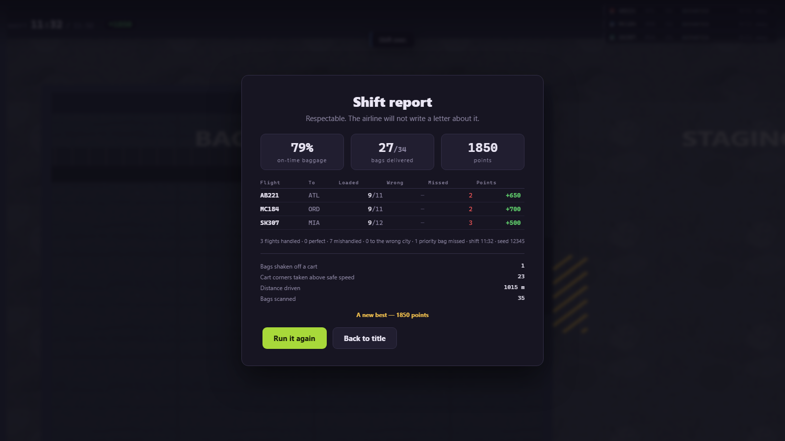
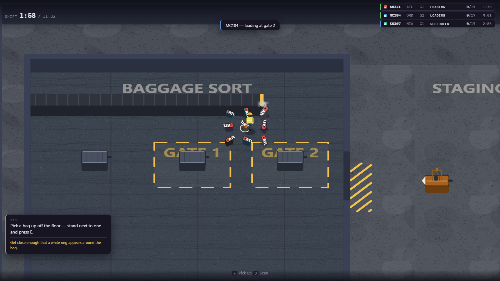
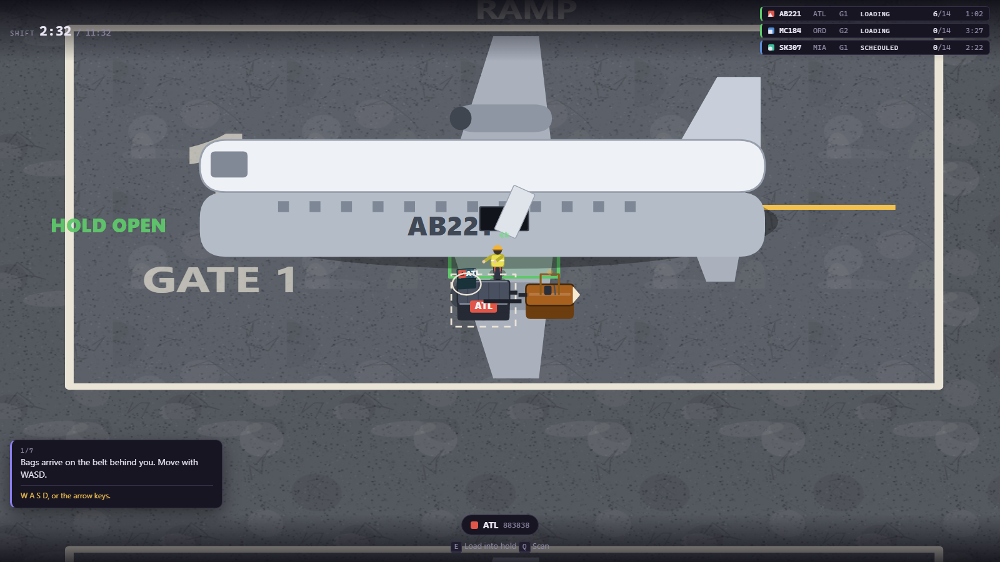
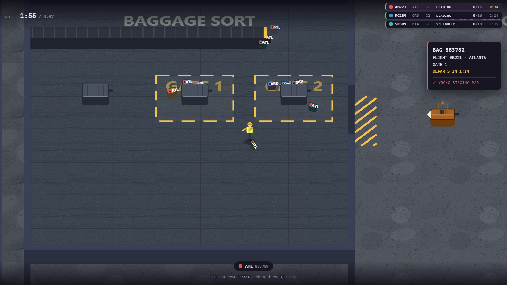

# Airport Baggage Crew

> Simple physical work becomes hilarious logistical panic, because the airport keeps
> operating whether the players are ready or not.

**▶ Play it: https://dumb-tony.github.io/AirportBaggageCrew/**

A chaotic co-op game about an underqualified ground-handling crew. Built from
[`GDD.md`](GDD.md) — the Master GDD is the authority on this project; this README covers
how to run it and what is actually built.

The live build is GitHub Pages serving `main` at root, so **every push republishes it**.
There is no build step: the game is plain ES modules and static files, and Pages already
serves them over http, which is the one thing the game needs (see below).

**Current state: Phase 1 feature-complete, plus a hardening pass, an audit of the tests
themselves, and a mutation pass that tested the audit. 1383 assertions green across ten
suites, and 14 of 14 deliberate bugs get caught.**
Three flights, fifty-one bags, eleven and a half minutes. Bags arrive on a conveyor, get
sorted into marked carts, hauled to a gate behind a tractor, and loaded into an aircraft
hold — and the aircraft leave on the clock whether you are ready or not. The shift ends
with a report telling you exactly what you managed, and a button to try again.

A competent crew clears **85%** of the shift and finishes on +3350; a careless one clears
48% and goes backwards. Every number behind that was measured by a bot playing through the
real keyboard path rather than guessed.

The shift **used to be thirty-four bags**, which broke the GDD's own stated range of
40–60, and it is fifty-one now — seventeen per flight, inside §20.4's range as well. It
took two passes to get there, and the second one is the interesting half.

The first pass read the telemetry: the crew stood **idle for 284 seconds of a 692-second
shift** and the belt never queued past six, so there was obviously room. It swept the
counts, picked 42, and rejected 48 for making bags unreachable.

Then it turned out the bot **could not drive**. Its reverse manoeuvre steered to aim the
tractor's *rear* at wherever it was going, so a target directly behind produced no
steering at all and it reversed in a dead straight line — it was driving half of every
haul home backwards at the 3 m/s reverse cap, against a tractor that does 7.00 m/s with
the throttle simply held down. Every trip cost roughly double what it should have, which
means **the whole sweep had been measured on an instrument that was wrong**, and both of
its conclusions were artefacts. Re-swept with a bot that drives, 51 wins outright: the
best score for a competent crew, zero dead ends, and a careless crew back in debt — which
matters, because at 42 bags a careless crew started finishing in *credit* and the suite
went red on a design claim it encodes. A game anybody can finish has no pressure.



It has sound, and it teaches itself. An eight-step rail walks you through the loop
**without ever stopping the clock** — the flights are already running while you learn to
pick a bag up, because a tutorial that paused the airport would be teaching a lie about
the only thing the game is about. Settings cover volumes, reduced motion, text size and a
schedule-pressure assist that gives you more time without changing a single verb.





The view is **oblique 2.5D** — still top-down Canvas 2D, but the ground is foreshortened
and everything on it stands up, which GDD §19.1 permits ("top-down or 2.5D").

Everything is drawn procedurally: no fetched assets, no external requests. Surfaces are
generated tiles (aggregate speckle, slab joints, worn wheel paths); the crew walk with a
real stride and counter-swinging arms; wheels turn on distance travelled; the cargo door
travels rather than snapping. **All of it derives from simulation values**, so two runs of
a seed animate identically and pausing freezes the airport mid-stride.



Those bags riding the conveyor are new, and they are a confession. Every bag on the belt
had been painted *underneath* the belt since Milestone 1 — the belt sorted in front of its
own cargo — so for six milestones the conveyor rendered as a featureless empty bar in a
game about bags arriving on a conveyor. The aircraft had been drawn back-to-front over the
same period, its shadow and gear facing the other way from its fuselage. Both were in the
screenshots on this page the whole time, and every render assertion in the project stayed
green, because each one sampled a single pixel at the centre of the canvas and checked it
was not black — which the ground fill alone satisfies.

`tools\m8-tests.js` replaces that with a differential: render the frame, remove exactly
one class of thing, render again, and count the pixels that changed. Removing the bags
from the belt changes 1127 pixels now and changed 0 before. It is the same trick for the
cart load, for the depth sort, and for whether GDD §16.6's text-size setting reaches the
canvas — where there is no CSS cascade, so each font has to scale by hand.

## Colour is never the only channel, and now that is a number

The destination tags are red, blue and green. The GDD says twice that colour must never
be the only channel; the README said the game obeyed; nothing had ever checked.
`tools\m9-tests.js` checks — WCAG relative luminance, CIEDE2000 perceptual distance, and
protanopia/deuteranopia/tritanopia simulation, run over the palette the game actually
imports rather than a table someone typed into a test.

**Six of seventeen signal pairs lose their hue** to at least one deficiency. The ORD and
MIA tags fall to 8.8 ΔE under tritanopia; the scanner's *right pad* against *wrong pad*
falls to 5.3 ΔE under deuteranopia, at 1.46:1 lightness; HOLD OPEN against HOLD CLOSED
does the same. None of that is visible by reading the hex codes, and none of it is a bug —
every one of those pairs is carried by a word or a glyph as well, which is the design
working exactly as the GDD demands. The suite proves each of those channels is real by
driving a live scanner card and reading the renderer's own source, so "it has a label too"
cannot quietly become an excuse.

It did find two things to fix. The board's departed row sat at **1.87:1** — its `opacity:.55`
dragged a mid-grey rail under WCAG 1.4.11's 3:1 floor, and auditing the colour token
without the opacity would have missed it. The painted gate numbers on the tarmac sat at
**1.93:1** against 3:1, sharing a deliberately faint colour with the road's lane markings.
The rail is now 3.36:1 and the gate labels have their own colour at 3.24:1; the lane lines
stayed faint and are recorded as decorative, because measurement showed all six floor
surfaces sit within 1.02:1–1.59:1 of each other — the game never identifies a zone by
colour at all, it labels every one of them in words.

---

## Run it

```bash
play.bat
```

That serves the game on `http://localhost:8361/` and opens a tab.

**The page must be served over http — it cannot be opened from disk.** The GDD (§21.1)
asks for both "runs by opening `index.html`" and "plain JavaScript ES modules"; those two
are mutually exclusive, because browsers block module loads on `file://` under CORS.
Modules won, since the whole architecture section depends on them. `play.bat` is the
substitute, and the page prints a clear message if you open it from disk anyway.

## Controls

On foot:

| Action | Input |
|---|---|
| Move | `W` `A` `S` `D` or arrow keys |
| Aim | Mouse, or your direction of travel if you never touch it |
| Pick up · put down · load into a cart or an open hold · take one back out | `E` |
| Throw | Hold `Space`, release |
| Scan | `Q` |
| Climb into the tractor · set a cart placard | `F` |

Driving:

| Action | Input |
|---|---|
| Throttle · brake-then-reverse | `W` · `S` |
| Steer | `A` `D` |
| Brake | `Space` |
| Hitch the cart behind you, or drop the last one | `E` |
| Get out | `F` |

`X` gets you unstuck — a player, a tractor, or a whole train wedged in scenery. It is a
local nudge out of the wall, not a teleport home, and it does nothing at all when nothing
is stuck (GDD §24.3).

Any time: `Esc` start / pause / resume (or close the settings panel) · `R` restart from
the pause screen · `F3` developer overlay (`B` bounds · `G` grid · `[` `]` time scale ·
`.` skip 10 s · `,` skip to the next flight event).

**Settings** are on the title card and the pause screen: per-category volumes and a mute,
reduced motion, text size, the step-by-step guide, and a schedule-pressure assist. The
assist stretches every flight window and changes nothing else — the aircraft still leave
without you, you simply get longer to catch them.

A bag counts as loaded only when it is released **inside the hold volume** — the green
box at the aircraft door. Getting it near the aeroplane is not the same thing. You can
throw one in from a few metres out, and you can load somebody else's bag by mistake: the
scanner will tell you, and let you do it anyway.

`E` handles the thing in front of you and `F` handles equipment. The GDD (§17.1) flags
that grab and throw conflict if both sit on the mouse, so they are split across `E` and
`Space`; §31.4 permits the choice as long as it is documented and consistent.

## Test it

```bash
tools\test.ps1
```

The test harness *is* a browser: it injects the suite into a scratch copy of the page,
serves it, drives it in headless Chrome, and greps the dumped DOM. Exit 0 means green.

```bash
tools\test.ps1 -Only m8
```

**The runner also enforces an assertion COUNT per suite**, and that is not decoration. A
green suite only ever proved that the assertions which *ran* passed — it said nothing
about how many ran. Most of the coverage here loops over a collection (the twenty-four
event names, the seventeen cue rows, three flights, nine waypoints), and a loop over an
empty collection contributes zero assertions and stays green; so does a section that
returns early after a failure. Both drain coverage in total silence. `tools\test.ps1`
holds a baseline count for each suite and the run fails when the number moves, in either
direction, which is the moment somebody has to look at it.

### And the suites are tested too — 14 of 14 mutations killed

```bash
tools\_mutate.ps1
```

The count baseline above closes one half of "is a green suite worth anything". The other
half is *can these assertions fail at all*, and the honest answer is that **reading them
is not an instrument.** A meta-audit read all nine suites, four agents deep, found roughly
twenty assertions that could not fail — and then missed two more in its own author's new
code the same day. An assertion that cannot fail looks exactly like one that can, and the
ones that survive review are the ones that read most convincingly.

So this measures instead. Fourteen deliberate reversions of real fixes — every one a bug
this project actually shipped — applied one at a time, each followed by the suites that
ought to care, in cost order. A mutation that leaves a suite green is a hole in the suite,
already named, with the file in hand.

**First pass: 10 of 14 killed. Four survivors, all four now closed, and three of them were
the same defect** — the assertion computed its expectation from the value under test:

- `m1 I5` asserted the camera zoom equals `min(viewWidthM, cssW / MIN_PX_PER_M)`, re-derived
  from the very constant the camera used, so both sides moved together. Deleting the
  readability floor outright (28 → 1) left m0, m1 and m6 green. It is also a regime nothing
  had ever rendered: the floor only *acts* below a ~1290 px window and every suite runs at
  ~1262 px. Closed with an absolute 15 px tag floor swept across six real window widths —
  at 640 px a bag tag is 20.2 px with the floor and 10.0 px without.
- `m6 A9` asserted the conveyor emits `sum(bagCount)` bags. True of any bag count at all,
  including 11 a flight, which is outside both GDD ranges and a shift a careless crew
  finishes in credit. Closed with §20.2's 40–60 and §20.4's 14–18 as absolute ranges.
- The §11.3 "corners taken above safe speed" statistic could go back to counting keystrokes
  and nothing noticed. `m2 F6c` bounds corners against spills correctly, but in a full-lock
  circle — *one* long overload episode against a once-per-episode latch. The artefact needs
  hundreds of brief corrections, so it needs a played shift: 37 corners against 5 spills
  measured, about 33× with the bug.
- The fourth is worse than a missing assertion. `recoverFuzz` and `recoverSpillProbe` were
  written *for* the "one press of X throws a bag off a stationary train" bug — and
  `tools\_soak.js` was their only caller. **Soak measures; it does not gate.** A prober for
  a known bug, sitting in a diagnostic, is not coverage. Both now run in `m6`.

Two more mutations were **killed in the wrong place**, which the cost-ordered suite list
makes visible and which is worth as much as the survivors: the separation-through-a-wall
bug was caught only by a played shift on one seed at one skill level, three and a half
minutes in, reporting "nothing stranded the crew" without being able to say what did; and
disabling the x-axis branch of `moveWithWalls` — the branch holding every doorway in the
game — was caught only *incidentally*, because the recover test happens to manufacture a
player inside a wall. Both now have direct assertions that run in milliseconds.

The harness holds itself to two rules, because a mutation tool can catch the same disease
it was built to cure. A substitution that does not match the expected number of times is an
ERROR and never a result — a find string that silently matched nothing would report every
suite green and read as a flawless run. And restore is byte-exact, runs in a `finally`, and
the run ends by asking git whether the files it touched came back.

All 1383 assertions also pass under Edge:

```bash
tools\test.ps1 -Browser edge
```

⚠ **That is not real cross-browser coverage and should not be read as any.** Edge is
Chromium; the run catches build, profile and policy differences and nothing whatever about
a different **engine**. There is no Gecko or WebKit runtime on this machine, so **Firefox
and Safari are genuinely untested.** What the code does have instead is a feature-detection
assertion (m6 section G) for every browser API it depends on — Canvas 2D, ES modules, rAF,
`roundRect`, `createPattern`, WebAudio and localStorage — and the last two are handled when
absent rather than assumed present.

Diagnostics, which measure rather than gate:

```bash
tools\smoketest.ps1 -Tests tools\_raf.js
```

```bash
tools\shot.ps1 -Setup tools\_shot-m6.js -Out docs\m6-report.png
```

Every screenshot in this README has a pose script in `tools\`, including the two hero
images — which previously did not, and that is precisely how a render bug survived in
them for six milestones. `_shot-vis-sortroom.js` deliberately stages bags on the belt, so
a regression shows up *in the picture* rather than merely being absent from it.

And the balance telemetry — GDD §28.4's list, produced by a bot that plays the game
through the real input path at three skill levels:

```bash
tools\smoketest.ps1 -Tests tools\_balance.js
```

And the route diagnostic, which samples the tractor every simulation step and bins it by
position — the one that found the balance numbers are pessimistic:

```bash
tools\smoketest.ps1 -Tests tools\_route.js
```

---

## Phase 1 scope

One 8–12 minute solo shift at a two-gate regional airport. Bags arrive on a conveyor;
the player sorts them onto carts, tows them to a gate with a tractor, and loads them into
an aircraft hold. Three flights depart **on the clock, whether or not the player is
ready**. Wrong loads are allowed and become consequences. The shift ends with a report.

### Explicitly out of scope for Phase 1

Networking and multiplayer · Steam · campaign, contracts, money, purchasing · save
progression beyond settings and a best report · arrivals and connections · weather · NPC
traffic · equipment breakdowns and nightmare events · belt loaders, forklifts, ULDs,
cargo · multiple airports or aircraft types · the lost-baggage warehouse · character
customisation · procedural terminal generation · full 3D or a WebGL engine · realistic
rigid-body physics · mobile and touch · accounts, servers, backends, analytics,
monetisation.

## Milestones

| # | Name | State |
|---|---|---|
| 0 | Skeleton and design locks | **done** — 126 assertions |
| 1 | The bag feels good | **done** — 159 assertions |
| 2 | Transport — carts, hitching, the tractor | **done** — 161 assertions |
| 3 | Sacred schedule — flight states, board, departures | **done** — 113 assertions |
| 4 | Outcomes and pressure — scoring, report, replay | **done** — 131 assertions |
| 5 | Onboarding and juice — audio, hints, accessibility | **done** — 197 assertions |
| 6 | Balance and hardening | **done** — 188 assertions |
| — | Hardening: four adversarial audits, and the coverage they exposed | **done** — 159 assertions |
| — | The renderer draws what it claims: differential pixel checks | **done** — 38 assertions |
| — | Colour is never the only channel, computed rather than believed | **done** — 111 assertions |
| 10 | The suites are tested too — mutation testing (GDD §35) | **done** — 14/14 killed |
| 11 | Is cornering a decision? (GDD §36) | **done** — answered: yes, for the veteran |

### Phase 1 acceptance (GDD §29)

`tools\m6-tests.js` is §29 made executable — one assertion per bullet, in the
document's own order. Functional, UX and Quality all pass.

**Five criteria are OPEN, and are reported that way rather than assumed green**, because
no program can stand in for a person:

- a first-time player completes the basic loop without reading a manual
- at least three external playtesters understand that the airport will not wait
- at least two report a memorable unscripted mistake or recovery
- repeated play produces improved organization or routing
- pressure comes from overlapping simple work, not confusing controls

The closest a test gets is section D, which plays whole shifts with a bot driving the
real input path. It shows a competent crew clearing 85% and finishing in credit, and a
careless one going backwards — but it cannot tell you whether the game *teaches* that.

## What the suites measure

Feel is not testable; the numbers behind it are. Each suite prints its own on every run,
so the Milestone 6 balance pass has before-and-after evidence instead of opinions.

Milestone 1 — the bag:

| | |
|---|---|
| Throw distance, normal bag | 1.4 m tapped, 12.1 m fully charged |
| Throw distance, fully charged | 3.8 m heavy · 16.8 m light |
| Two seconds of walking | 8.1 m empty-handed · 5.1 m carrying a heavy bag |
| A bag thrown at 8 m/s | slides 1.35 s before stopping |
| Conveyor | 21 m of belt at 1.6 m/s — a 13 s ride |
| Authored shift | 51 bags across 3 flights; heavy bags 12% AB221, 29% MC184, 41% SK307 |
| 100 loose bags | 0.17 ms per simulation step, against a 16.67 ms budget |

Milestone 2 — transport:

| | |
|---|---|
| Turning radius | 1.7 m at 1.5 m/s · 1.7 m at 3 m/s · 3.9 m at 7 m/s |
| Nought to top speed | 1.17 s |
| A loaded cart to gate 1 / gate 2 | 19.6 s / 20.6 s of driving, 10 of 10 delivered |
| Drawbar stretch over a full run | under 0.02 m |
| Cart capacity | 10 light bags (out of slots) · 6 heavy, 186 kg (out of weight) |
| Three-cart train driven hard | 11 of 12 aboard, 1 shaken off |
| Ten bags, full-lock circle at 7 m/s | 9 shaken off — the same circle at 1.2 m/s: none |
| Three loaded carts + 100 loose bags | 0.33 ms per step |

Milestone 3 — the schedule:

| | |
|---|---|
| A no-input shift | all 3 flights depart, all 50 bags classified, 0 delivered |
| The same shift, worked by a scripted bot | 50 of 50 delivered, 100% on-time baggage |
| A step of the whole airport | 0.07 ms against a 16.67 ms budget |
| Ten minutes of airport | simulates in ~2.5 s — about 240x real time |
| Gate 1, used twice | AB221 clear at 195 s, SK307 taxis in at 201 s |

Milestone 6 — balance and hardening. Every row below is a bot playing the real game
through the real input path, three seeds each:

| | |
|---|---|
| A competent crew | 85% of bags delivered, +3350 points (mean of 3 seeds) |
| A careless one | 48%, −1583 points (mean of 3 seeds) |
| Before the M6 balance pass | 32% and −4000 points, on every seed, at every skill |
| The authored shift | 51 bags across 3 flights (17 each), 11:32 |
| Time to first bag aboard | 140 s |
| Distance per shift | 896 m walked, 1580 m driven |
| 124 bags and three loaded carts | 0.079 ms per step — 210x frame-budget headroom |
| Bags stranded out of reach | 0 |
| Queue depth | peaks at 11 bags waiting, mean 3.4 |
| Where missed bags end up | 100% still sitting in a cart |
| Fuzzing | 21 shifts, 221 min simulated, 0 errors, 0 invariant violations |
| Tractor top speed, throttle held | **7.00 m/s** — what the vehicle does |
| …what the bot manages over 52 m of empty ramp | **6.76 m/s**, throttle held 97% of the way |

That last pair is the most useful thing on this page, and it is a warning rather than a
result. `tools\_route.js` samples the tractor every simulation step and bins it by
position; it found that the crew bot drives the open ramp backwards almost as far as it
drives it forwards, with a mean *signed* speed of 0.03 m/s. So **every per-trip cost in
the balance report is roughly double the real one**, and the conclusion drawn from those
costs — that the haul is too long and the gates should move closer — is not supported by
anything. The map is fine. The instrument cannot drive.

The four-line fix works and takes the open run to 6.96 m/s at full throttle. It also
drops delivery from 79% to 54%, because the hitch, drop and unload phases were tuned
around the broken driving and encode its speeds. That is written up in full at the top of
`tools\_route.js` — every fix tried and exactly how each one failed — and reverted, on
the grounds that a regression shipped to chase an improvement is still a regression.

Milestone 5 — onboarding and juice:

| | |
|---|---|
| A 200 s shift, run with live audio and with none | `describe()` snapshots identical to the byte |
| The rail | 8 steps · 11 s on one step before the hint appears |
| Schedule-pressure assist | multiplies the authored shift: Relaxed 1.15×, Unhurried 1.35× |
| 600 live frames with audio wired in | 0.020 ms per frame against a 16.7 ms budget |

## Layout

```text
index.html      styles.css      play.bat
src/
  main.js         bootstrap and the only rAF loop
  config.js       every tuning number
  game.js         authoritative state, fixed-step driver, pause/restart
  core/           clock · input · eventBus · rng · grid
  data/           airport.js — the map · flights.js — the authored shift
  entities/       bag · player · conveyor · cart · tractor · aircraft
  systems/        containment · baggageFlow · hitching · interaction · physics
                  flightSchedule · announcements · scoring · save
                  audio.js       every sound, inert until a user gesture arms it
                  onboarding.js  the eight-step rail, advisory over a live shift
  render/         camera · renderer · sprites · textures · fx (all Canvas 2D)
  ui/             hud.js · scannerCard.js · flightBoard.js · shiftReport.js
                  settings.js    volumes · reduced motion · text size · assist
  dev/            debugOverlay.js — F3, never player-facing
tools/            serve · smoketest · test · shot · m0-m7 suites
                  _bot.js        a crew that plays through the real input path
                  _balance.js    GDD §28.4 telemetry, printed rather than asserted
                  _soak.js       fuzz: random keys, chaos, and a clumsy crew bot
                  _invariants.js the sweep the soak and m6 section H both run
docs/             screenshots
```

Of the suggested tree in GDD §21.2, only `core/stateMachine.js` is still missing, and it
never will arrive — the flight lifecycle turned out to be a pure function of the clock,
which needs no machinery. Everything else landed with the milestone that filled it, per
GDD §31.1.3. The GDD `systems/baggageFlow.js` is split here into `containment.js` (the
one writer of a bag location) and `baggageFlow.js` (spawning and loose-bag movement).

---

## Known limitations at Milestone 6

- **Nobody has playtested it.** Four of GDD §29's criteria need external players and are
  reported OPEN by the m6 suite rather than assumed green — see *Phase 1 acceptance*
  above. Everything a program can check does pass; whether the game *teaches* what it
  needs to is the one thing still genuinely unknown, and it is the top of the list.
- ✅ **The multi-cart question is answered — and the answer is no.** This entry used to say
  the bot had never used a train, that the "bottleneck is trips to the gate" was therefore
  a statement about the policy rather than the game, and that **the number to beat is
  80%**. Both halves are now settled.

  The cart management was rebuilt: the train is **permanent**, up to three carts, and
  nothing is ever shed — which is what the three earlier attempts kept failing on, because
  a cart released while stationary sits inside hitch range and is picked straight back up.
  The train also tours the gates, serving a second hold without driving home.

  It works, and it costs more than it saves:

  | policy | gates per round trip | delivered |
  |---|---|---|
  | fetch any live cart | 1.56 | 61% |
  | fetch one within 6 m | 1.33 | 68% |
  | **never fetch (shipped)** | **1.00** | **85%** |

  Coupling is a manoeuvre, and a trip that starts with one starts later: the belt queue
  went from 10 bags to 14 while the crew fetched a cart. The shared sixty metres is real
  and it is smaller than the delay. Touring stays switched on because it is free when a
  coupled cart happens to be live — it simply almost never is, and the counters say why:
  at a gate, **6.7 of 6.7 other carts on the train belong to flights that have already
  departed**. Three sequential flights do not give you two open holds and two loaded carts
  at the same moment often enough to matter.

  The number to beat was 80%. It is **85%** now, and that came from teaching the bot to
  drive rather than from teaching it to couple.
- **Spill tuning: the statistic was wrong, the model was not.** Once the bot could drive,
  the shift report started claiming **168 corners above safe speed** — one every three and
  a half seconds — against **5.7 bags actually shed**. Those two numbers cannot both be
  describing the same thing.

  `tools\_spill.js` measured the whole distribution rather than the two counters. The
  median overload lasts 100 ms and costs **0.040** of a cart's stability; **56% of them
  cost under 0.05 and recover within a tenth of a second**. The model is behaving exactly
  as designed — a brief overload is nothing, a sustained one loses a bag. The *counter*
  fired on the way in to every one of them.

  That is a keyboard artefact. Steering is binary — `steer` is −1, 0 or +1 — so every
  course correction is full lock, and full lock above about 2.6 m/s with a loaded cart
  clears the lateral threshold. The counter was measuring keystrokes. It now counts an
  overload only once it has cost a quarter of the cart's grip, which is **22 per shift**
  against 5.7 spills: a statistic that means "I nearly lost that load" instead of "I
  nudged the stick". GDD §11.3 asks for an odd statistic, and one that ticks every few
  seconds is noise.

  ✅ **ANSWERED 2026-08-24 — cornering is a decision, and it is the veteran's decision.**
  This entry used to end "genuinely still open: whether 5.7 bags a shift is the right
  price". It is not open any more, and the answer needed a bot that could ease off, because
  `steer` is −1/0/+1 and the throttle is held or not — a measurement of a choice the
  instrument cannot express is a measurement of the instrument.

  ⚠ **First the two thresholds had to be told apart.** Above about 2.6 m/s a loaded
  full-lock turn starts DRAINING stability; a bag does not actually leave until **4.5**.
  Only the first number had ever been written down, so the careful policy was built on it
  and spent its time avoiding a cost that does not exist at that speed. The curve, ten light
  bags round a full-lock circle: `1.2→0  2.6→0  3.5→0  4.5→4  5.5→7  6.5→8  7.0→9`.

  Corrected, over nine shifts played twice each on the same seeds — **spills fall 32%, from
  50 to 34, for 0.5–2.3% of the shift spent off the throttle** — and the benefit is not
  spread evenly:

  | skill | delivery, paired | points, paired |
  |---|---|---|
  | novice | +0, −4, +6 | noise |
  | average | +0, +0, −1 | neutral |
  | **veteran** | **+1, +4, +1** | **+750, +1500, +250** |

  Which retires a different mystery this file has carried since M6: **the veteran scored
  worse than the average crew and nobody knew why.** It hauls at six bags instead of eight,
  so it makes more trips, corners three times as often (55 a shift against 17) and sheds
  most — and nothing in its policy accounted for what it was carrying. The extra trips were
  paying for themselves; the cornering was taking it back.

  **The shipped bot still drives flat out, deliberately.** Making care the default is a
  balance change: it takes the novice median from −1850 to −250 and its delivery from 47%
  to 59%, and `m6 D5`/`D6` encode the claim that a careless crew does not clear the shift —
  which is why the shift is 51 bags in the first place. That re-opens the bag count for a
  third time, and it is the next milestone rather than a footnote to this one.
- **Audio is synthesised, not designed.** Every cue is an oscillator or filtered noise.
  It is legible and it escalates, but it is a placeholder for a sound pass, and the
  mixing between the three beds and the one-shots has not been balanced against anything.
- **Key rebinding is not in the settings panel.** GDD §16.6 scopes it to the full product
  rather than the prototype. The binding table is already data in `core/input.js`, so it
  is a UI away rather than a rewrite.
- **Arrivals do not exist.** Every flight is a departure. GDD §4.3 arrivals and §4.4
  connections are explicitly post-MVP.
- **The sort room has a lot of empty floor**, and sorting is 54% of the shift. Level
  layout is the next real lever on pacing — but the obvious move measured *worse*, and
  that is worth knowing before anyone tries it again.

  A competent crew parks its train on the line **y 15.2**, five metres north of the
  painted bays. Swept and confirmed: 85% delivered parking at (20, 15.2) against 78% at
  (23, 15.2) and 77% at (25, 15.2) — bags spread along the whole belt as the feed defers,
  so mid-belt beats the discharge end. Which means a player who reads the paint walks
  about seven metres a bag and one who ignores it walks about three: **the signage points
  away from the good line.**

  Bringing the bays north to meet it cut walking from 896 m to 824 m and cost twelve
  points of delivery (85% → 73%), took a careless crew from 48% to 34%, and produced a
  dead end where there had been none — the carts start closer to the belt, and the room
  left to manoeuvre a nine-metre train around them is what pays for it. Reverted.

  ⚠ **Honest limit:** the regression shows up in the crew bot's cart pickup, and a human
  is not subject to the bot's approach geometry, so it may be an instrument artefact. But
  it is the only instrument there is, it says the change is worse, and the case for moving
  the bays was a theory about signage rather than a measurement. `m0` F11b now asserts each
  cart's starting anchor sits inside its own painted bay, so the next attempt cannot move
  the paint and leave the carts behind.
- ✅ **Parked carts no longer overlap.** Two on the same square metre both answered to `E`
  and the nearest centre won, so standing between them loaded the one you did not mean —
  confusing, and the single most common way the bot lost time before it learned to circle.
  Free carts now push each other apart to a cart's width, gently, over a few frames.

  **Towed carts deliberately do not push parked ones aside**, and that was tried: it turns
  a passing train into a bulldozer, driving carts into the sort-room doorway and producing
  six dead ends across average and veteran where there had been none. It is also only half
  a collision model — the tractor drives straight through a parked cart — so the
  disruption arrives without the blocking that would explain it. A cart on the drawbar is
  the constraint's business; the complaint was about parked ones, and that is what changed.
- **Carts are placed, not driven** — a towed cart is positioned by the drawbar constraint
  and then pushed out of any wall it lands in, rather than colliding properly.

  This entry used to add "but a cart taking a tight corner can visibly clip a wall for a
  frame". **That was never measured, and it does not happen.** `pushOutOfWalls` works on a
  circle, so a clearing circle does not prove the rotated 2.4 × 1.5 m rectangle inside it
  clears too — the two could disagree exactly mid-corner, which is why the claim was
  plausible. Driving a train out through the sort-room doorway, round on the apron and back
  in — the tightest corner in the game, taken both ways, because the drawbar swings the
  other way coming back — gives **0 of 73,984 cart-perimeter samples inside a wall**.

  The sampling is the part worth stating: 0.25 m spacing around the perimeter, against
  walls 0.6 m thick. The first version sampled corners and edge midpoints, 1.2 m apart on
  the long edge — twice the wall thickness — and would have reported a clean run whether
  or not one happened. A geometry check coarser than the geometry it is checking is
  vacuous, and `m2` E6.pre asserts the spacing so it cannot quietly become so again.
- **Stacking is separation, not physics.** Bags push each other apart on the floor; they
  do not stack into a pile with height. GDD §6.4 explicitly permits this.
- **The live render loop is only partly provable in tests.** Headless Chrome in
  `--dump-dom` mode delivers 1–3 `requestAnimationFrame` callbacks in total and then
  stops — measured across three flag sets with `tools\_raf.js`. The suites assert that
  the real loop ran at boot and painted, then drive `game.frame()` directly — the same
  entry point the rAF callback calls. That the browser *keeps* calling it is five lines
  in `main.js`, checked by eye in a real browser.

## Reuse

Per `C:\Dev\INDEX.md`, this project copies rather than reinvents:

| What | Taken from |
|---|---|
| `mulberry32` seeded PRNG, `hashStr` (FNV-1a) | `SomethingsDifferent\somethingsdifferent.html:664, :5563` |
| `window.onerror` crash banner | `SomethingsDifferent\somethingsdifferent.html:444` |
| Headless-Chrome test harness, dev server, screenshot tool | `SomethingsDifferent\tools\{smoketest,serve,test,shot}.ps1` |
| `createInitialState` + observable state boundary | `TheBenefactors\src\engine\game-state.js` (clone-on-read deliberately dropped — see `src/game.js`) |
| UI style tokens (Quicksand / Baloo 2, panel and accent palette) | Chameleon and Something's Different |

No runtime network requests, no external assets, no dependencies.
