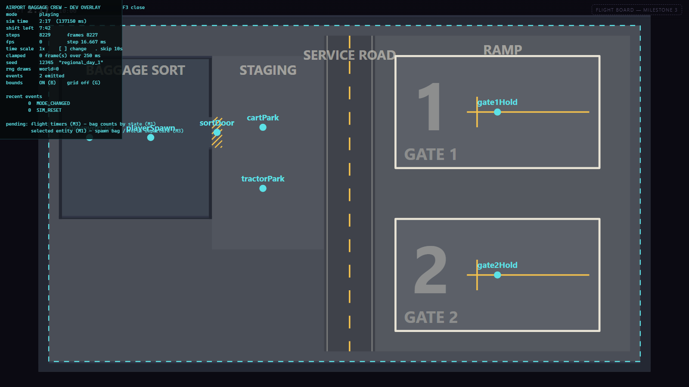

# Airport Baggage Crew

> Simple physical work becomes hilarious logistical panic, because the airport keeps
> operating whether the players are ready or not.

A chaotic co-op game about an underqualified ground-handling crew. Built from
[`GDD.md`](GDD.md) — the Master GDD is the authority on this project; this README covers
how to run it and what is actually built.

**Current state: Milestone 0 — skeleton and design locks. 117 assertions green.**
There is no player, no bag, no cart, no flight yet. What exists is the spine everything
else hangs off: the simulation clock, input, seeded RNG, the state boundary, the airport
map, pause/restart, and a developer overlay.



---

## Run it

```bash
play.bat
```

That serves the game on `http://localhost:8361/` and opens a tab.

**The page must be served over http — it cannot be opened from disk.** The GDD (§21.1)
asks for both "runs by opening `index.html`" and "plain JavaScript ES modules"; those two
are mutually exclusive, because browsers block module loads on `file://` under CORS.
Modules won, since the GDD's whole architecture section depends on them. `play.bat` is
the substitute, and the page prints a clear message if you open it from disk anyway.

## Controls

| Action | Key |
|---|---|
| Start shift / pause / resume | `Esc` |
| Restart shift (from the pause screen only) | `R` |
| Developer overlay | `F3` |

Inside the overlay: `B` interaction bounds · `G` grid · `[` `]` time scale · `.` skip 10 s.

Movement, grab, scan, interact, throw and driving are bound already
(`src/core/input.js`) but have nothing to act on until Milestone 1.

## Test it

```bash
tools\test.ps1
```

There is no Node.js on this machine, so the test harness *is* a browser: it injects the
suite into a scratch copy of the page, serves it, drives it in headless Chrome, and greps
the dumped DOM. Exit 0 means green.

```bash
tools\test.ps1 -Only m0
```

Diagnostics, which measure rather than gate:

```bash
tools\smoketest.ps1 -Tests tools\_raf.js
```

```bash
tools\shot.ps1 -Setup tools\_shot-playing.js -Out docs\m0-airport.png
```

---

## Phase 1 scope

One 8–12 minute solo shift at a two-gate regional airport. Bags arrive on a conveyor;
the player sorts them onto carts, tows them to a gate with a tractor, and loads them into
an aircraft hold. Three flights depart **on the clock, whether or not the player is
ready**. Wrong loads are allowed and become consequences. The shift ends with a report.

### Explicitly out of scope for Phase 1

Networking and multiplayer · Steam · campaign, contracts, money, purchasing · save
progression beyond settings and a best report · arrivals and connections · weather · NPC
traffic · equipment breakdowns and nightmare events · belt loaders, forklifts, ULDs,
cargo · multiple airports or aircraft types · the lost-baggage warehouse · character
customisation · procedural terminal generation · full 3D or a WebGL engine · realistic
rigid-body physics · mobile and touch · accounts, servers, backends, analytics,
monetisation.

## Milestones

| # | Name | State |
|---|---|---|
| 0 | Skeleton and design locks | **done** — 117 assertions |
| 1 | The bag feels good | next |
| 2 | Transport | |
| 3 | Sacred schedule | |
| 4 | Outcomes and pressure | |
| 5 | Onboarding and juice | |
| 6 | Balance and hardening | |

## Layout

```text
index.html      styles.css      play.bat
src/
  main.js         bootstrap and the only rAF loop
  config.js       every tuning number
  game.js         authoritative state, fixed-step driver, pause/restart
  core/           clock · input · eventBus · rng
  data/           airport.js — the map, as data plus pure geometry helpers
  render/         camera · renderer (Canvas 2D)
  ui/             hud.js — DOM/CSS panels
  dev/            debugOverlay.js — F3, never player-facing
tools/            serve · smoketest · test · shot · m0-tests · diagnostics
docs/             screenshots
```

The GDD's suggested tree (§21.2) also lists `core/stateMachine.js`, `entities/`,
`systems/`, `ui/flightBoard.js`, `ui/scannerCard.js`, `ui/shiftReport.js` and
`data/flights.js`. Those are deliberately absent: GDD §31.1.3 asks for clean boundaries
rather than half-built features, so each file arrives with the milestone that fills it.

---

## Known limitations at Milestone 0

- **No gameplay.** By design. Milestone 0's exit criterion is a stable blank simulation
  with pause, restart and a deterministic seed.
- **The shift clock runs past its end.** The end-of-shift transition and report land with
  Milestone 4; today the clock simply keeps counting and `shiftRemainingMs` reads 0.
- **The live render loop is only partly provable in tests.** Headless Chrome in
  `--dump-dom` mode delivers 1–3 `requestAnimationFrame` callbacks in total and then
  stops — measured across three flag sets with `tools\_raf.js`. The suite therefore
  asserts that the real loop ran at boot and painted, then drives `game.frame()`
  directly — the same entry point the rAF callback calls. That the browser *keeps*
  calling it is five lines in `main.js`, checked by eye in a real browser.
- **No audio.** GDD §18 audio lands with Milestone 5.

## Reuse

Per `C:\Dev\INDEX.md`, this project copies rather than reinvents:

| What | Taken from |
|---|---|
| `mulberry32` seeded PRNG, `hashStr` (FNV-1a) | `SomethingsDifferent\somethingsdifferent.html:664, :5563` |
| `window.onerror` crash banner | `SomethingsDifferent\somethingsdifferent.html:444` |
| Headless-Chrome test harness, dev server, screenshot tool | `SomethingsDifferent\tools\{smoketest,serve,test,shot}.ps1` |
| `createInitialState` + observable state boundary | `TheBenefactors\src\engine\game-state.js` (clone-on-read deliberately dropped — see `src/game.js`) |
| UI style tokens (Quicksand / Baloo 2, panel and accent palette) | Chameleon and Something's Different |

No runtime network requests, no external assets, no dependencies.
