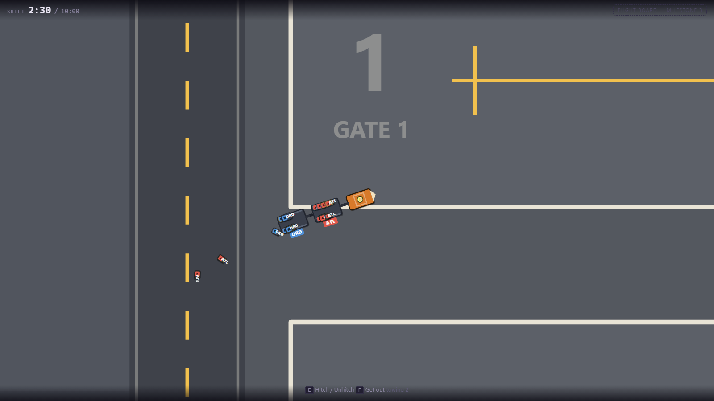

# Airport Baggage Crew

> Simple physical work becomes hilarious logistical panic, because the airport keeps
> operating whether the players are ready or not.

**▶ Play it: https://dumb-tony.github.io/AirportBaggageCrew/**

A chaotic co-op game about an underqualified ground-handling crew. Built from
[`GDD.md`](GDD.md) — the Master GDD is the authority on this project; this README covers
how to run it and what is actually built.

The live build is GitHub Pages serving `main` at root, so **every push republishes it**.
There is no build step: the game is plain ES modules and static files, and Pages already
serves them over http, which is the one thing the game needs (see below).

**Current state: Milestone 2 — transport. 382 assertions green.**
Bags arrive on a conveyor, carry identity, and can be picked up, carried, thrown,
scanned, and sorted into marked carts. Carts hitch into trains behind a tractor and get
hauled to the gates — shedding luggage if you take the corner too fast. Nothing departs
yet: the flight schedule is Milestone 3.



---

## Run it

```bash
play.bat
```

That serves the game on `http://localhost:8361/` and opens a tab.

**The page must be served over http — it cannot be opened from disk.** The GDD (§21.1)
asks for both "runs by opening `index.html`" and "plain JavaScript ES modules"; those two
are mutually exclusive, because browsers block module loads on `file://` under CORS.
Modules won, since the whole architecture section depends on them. `play.bat` is the
substitute, and the page prints a clear message if you open it from disk anyway.

## Controls

On foot:

| Action | Input |
|---|---|
| Move | `W` `A` `S` `D` or arrow keys |
| Aim | Mouse, or your direction of travel if you never touch it |
| Pick up · put down · load into a cart · take off a cart | `E` |
| Throw | Hold `Space`, release |
| Scan | `Q` |
| Climb into the tractor · set a cart placard | `F` |

Driving:

| Action | Input |
|---|---|
| Throttle · brake-then-reverse | `W` · `S` |
| Steer | `A` `D` |
| Brake | `Space` |
| Hitch the cart behind you, or drop the last one | `E` |
| Get out | `F` |

Any time: `Esc` start / pause / resume · `R` restart from the pause screen · `F3`
developer overlay (`B` bounds · `G` grid · `[` `]` time scale · `.` skip 10 s).

`E` handles the thing in front of you and `F` handles equipment. The GDD (§17.1) flags
that grab and throw conflict if both sit on the mouse, so they are split across `E` and
`Space`; §31.4 permits the choice as long as it is documented and consistent.

## Test it

```bash
tools\test.ps1
```

There is no Node.js on this machine, so the test harness *is* a browser: it injects the
suite into a scratch copy of the page, serves it, drives it in headless Chrome, and greps
the dumped DOM. Exit 0 means green.

```bash
tools\test.ps1 -Only m2
```

Diagnostics, which measure rather than gate:

```bash
tools\smoketest.ps1 -Tests tools\_raf.js
```

```bash
tools\shot.ps1 -Setup tools\_shot-m2.js -Out docs\m2-transport.png
```

---

## Phase 1 scope

One 8–12 minute solo shift at a two-gate regional airport. Bags arrive on a conveyor;
the player sorts them onto carts, tows them to a gate with a tractor, and loads them into
an aircraft hold. Three flights depart **on the clock, whether or not the player is
ready**. Wrong loads are allowed and become consequences. The shift ends with a report.

### Explicitly out of scope for Phase 1

Networking and multiplayer · Steam · campaign, contracts, money, purchasing · save
progression beyond settings and a best report · arrivals and connections · weather · NPC
traffic · equipment breakdowns and nightmare events · belt loaders, forklifts, ULDs,
cargo · multiple airports or aircraft types · the lost-baggage warehouse · character
customisation · procedural terminal generation · full 3D or a WebGL engine · realistic
rigid-body physics · mobile and touch · accounts, servers, backends, analytics,
monetisation.

## Milestones

| # | Name | State |
|---|---|---|
| 0 | Skeleton and design locks | **done** — 117 assertions |
| 1 | The bag feels good | **done** — 125 assertions |
| 2 | Transport — carts, hitching, the tractor | **done** — 140 assertions |
| 3 | Sacred schedule — flight states, board, departures | next |
| 4 | Outcomes and pressure — scoring, report, replay | |
| 5 | Onboarding and juice — audio, hints, accessibility | |
| 6 | Balance and hardening | |

## What the suites measure

Feel is not testable; the numbers behind it are. Each suite prints its own on every run,
so the Milestone 6 balance pass has before-and-after evidence instead of opinions.

Milestone 1 — the bag:

| | |
|---|---|
| Throw distance, normal bag | 1.4 m tapped, 12.1 m fully charged |
| Throw distance, fully charged | 3.8 m heavy · 16.8 m light |
| Two seconds of walking | 8.1 m empty-handed · 5.1 m carrying a heavy bag |
| A bag thrown at 8 m/s | slides 1.35 s before stopping |
| Conveyor | 21 m of belt at 1.6 m/s — a 13 s ride |
| Authored shift | 50 bags across 3 flights; heavy bags 6% AB221, 31% MC184, 39% SK307 |
| 100 loose bags | 0.23 ms per simulation step, against a 16.67 ms budget |

Milestone 2 — transport:

| | |
|---|---|
| Turning radius | 1.7 m at 1.5 m/s · 1.7 m at 3 m/s · 3.9 m at 7 m/s |
| Nought to top speed | 1.17 s |
| A loaded cart to gate 1 / gate 2 | 19.6 s / 20.6 s of driving, 10 of 10 delivered |
| Drawbar stretch over a full run | under 0.02 m |
| Cart capacity | 10 light bags (out of slots) · 6 heavy, 186 kg (out of weight) |
| Three-cart train driven hard | 11 of 12 aboard, 1 shaken off |
| Ten bags, full-lock circle at 7 m/s | 9 shaken off — the same circle at 1.2 m/s: none |
| Three loaded carts + 100 loose bags | 0.33 ms per step |

## Layout

```text
index.html      styles.css      play.bat
src/
  main.js         bootstrap and the only rAF loop
  config.js       every tuning number
  game.js         authoritative state, fixed-step driver, pause/restart
  core/           clock · input · eventBus · rng · grid
  data/           airport.js — the map · flights.js — the authored shift
  entities/       bag · player · conveyor · cart · tractor
  systems/        containment · baggageFlow · hitching · interaction · physics
  render/         camera · renderer (Canvas 2D)
  ui/             hud.js · scannerCard.js
  dev/            debugOverlay.js — F3, never player-facing
tools/            serve · smoketest · test · shot · m0/m1/m2 suites · diagnostics
docs/             screenshots
```

The suggested tree in GDD §21.2 also lists `core/stateMachine.js`,
`entities/aircraft.js`, `systems/flightSchedule.js`, `systems/scoring.js`,
`systems/announcements.js`, `systems/save.js` and three more UI panels. Those are
deliberately absent: GDD §31.1.3 asks for clean boundaries rather than half-built
features, so each file arrives with the milestone that fills it. The GDD
`systems/baggageFlow.js` is split here into `containment.js` (the one writer of a bag
location) and `baggageFlow.js` (spawning and loose-bag movement).

---

## Known limitations at Milestone 2

- **No aircraft and no flight schedule.** You can haul a loaded cart to a gate and park
  it there, and that is where the operation stops. Flight records exist as static data so
  a tag and a placard have something to say; nothing advances, closes or departs.
- **Nothing is scored.** Correct, wrong and missed are not evaluated until Milestone 4,
  so a perfectly sorted train and a cart full of the wrong city are worth the same today.
- **The shift clock runs past its end.** The end-of-shift transition and report land with
  Milestone 4; today the clock keeps counting and `shiftRemainingMs` reads 0.
- **Spill tuning is provisional.** A full-lock circle at top speed empties a cart, which
  is probably too harsh even for a deliberate stunt. Milestone 6 owns the balance pass.
- **Carts are placed, not driven.** A towed cart is positioned by the drawbar constraint
  and then pushed out of any wall it lands in, rather than colliding properly. It cannot
  end up inside geometry — the suite checks that over a full run — but a cart taking a
  tight corner can visibly clip a wall for a frame.
- **No audio.** GDD §18 wants a scanner beep, a wrong-buzz and escalating announcements;
  every one of those cues is visual-only until Milestone 5.
- **Stacking is separation, not physics.** Bags push each other apart on the floor; they
  do not stack into a pile with height. GDD §6.4 explicitly permits this.
- **The live render loop is only partly provable in tests.** Headless Chrome in
  `--dump-dom` mode delivers 1–3 `requestAnimationFrame` callbacks in total and then
  stops — measured across three flag sets with `tools\_raf.js`. The suites assert that
  the real loop ran at boot and painted, then drive `game.frame()` directly — the same
  entry point the rAF callback calls. That the browser *keeps* calling it is five lines
  in `main.js`, checked by eye in a real browser.

## Reuse

Per `C:\Dev\INDEX.md`, this project copies rather than reinvents:

| What | Taken from |
|---|---|
| `mulberry32` seeded PRNG, `hashStr` (FNV-1a) | `SomethingsDifferent\somethingsdifferent.html:664, :5563` |
| `window.onerror` crash banner | `SomethingsDifferent\somethingsdifferent.html:444` |
| Headless-Chrome test harness, dev server, screenshot tool | `SomethingsDifferent\tools\{smoketest,serve,test,shot}.ps1` |
| `createInitialState` + observable state boundary | `TheBenefactors\src\engine\game-state.js` (clone-on-read deliberately dropped — see `src/game.js`) |
| UI style tokens (Quicksand / Baloo 2, panel and accent palette) | Chameleon and Something's Different |

No runtime network requests, no external assets, no dependencies.
